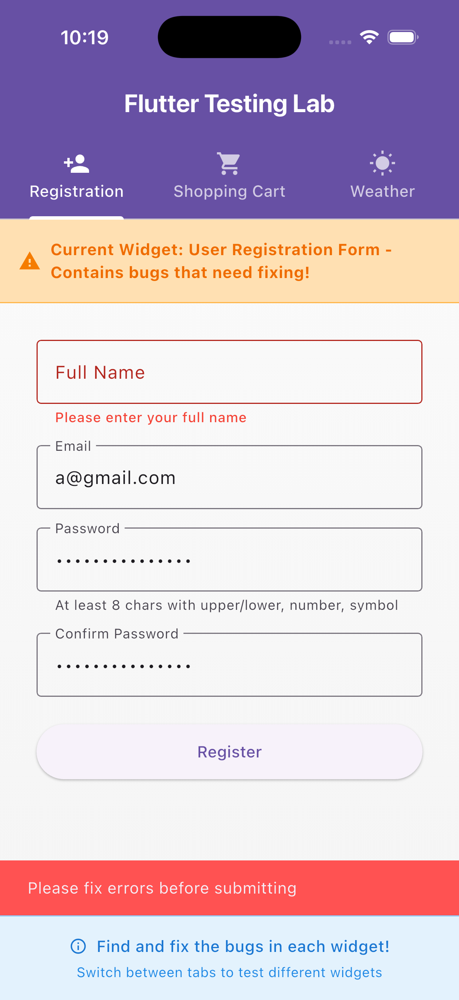
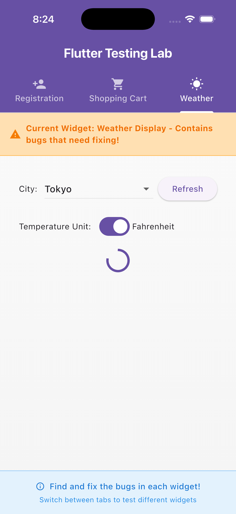

# Flutter Testing Laboratory

A comprehensive Flutter testing project demonstrating bug fixes, validation logic, state management, and comprehensive test coverage across three major widgets.

## Table of Contents

- [Project Overview](#project-overview)
- [Features Implemented](#features-implemented)
- [Tech Stack](#tech-stack)
- [Test Results](#test-results)
- [Widget 1: User Registration Form](#widget-1-user-registration-form)
- [Widget 2: Shopping Cart](#widget-2-shopping-cart)
- [Widget 3: Weather Display](#widget-3-weather-display)
- [Running the Project](#running-the-project)

## Project Overview

This project is part of the Flutter Mentorship program (Week 5), focusing on **debugging**, **testing**, and **validation**. I identified and fixed critical bugs in three widgets, added comprehensive test coverage, and implemented production-ready validation logic.

## Features Implemented

### Core Functionality

- User registration with comprehensive form validation
- Shopping cart with quantity management and discount calculation
- Weather display with async data fetching and unit conversion
- Real-time validation feedback
- Error handling and edge case management

### Testing Coverage

- Unit tests for validation logic and data models
- Widget tests for UI state management
- Integration tests for async operations
- Edge case testing (100% discount, empty states, invalid inputs)

## Tech Stack

| Category | Technology |
|----------|------------|
| **Framework** | Flutter |
| **Language** | Dart |
| **Testing** | Flutter Test Framework, Mockito |
| **State Management** | StatefulWidget |
| **Architecture** | Clean Architecture with Services and Models |

## Test Results

All tests pass successfully:

```bash
flutter test
```

**Result:** 36 tests passed

```
00:05 +36: All tests passed!
```

---

## Widget 1: User Registration Form

### Bug Description

The registration form had critical validation issues:

| Issue | Problem |
|-------|---------|
| Email validation | Accepted invalid formats like `a@` or `@b` |
| Password validation | Allowed weak passwords without uppercase, digit, or symbol |
| Form validation | Submitted even with empty or invalid fields |
| Missing tests | No unit or widget tests to verify validation |

### Solution Implemented

#### Validation Logic

- Implemented regex-based email validation: `^[\w-]+(\.[\w-]+)*@([\w-]+\.)+[a-zA-Z]{2,7}$`
- Added strong password rules:
  - Minimum 8 characters
  - At least one uppercase letter
  - At least one lowercase letter
  - At least one digit
  - At least one special character
- Applied form validation before submission using `_formKey.currentState?.validate()`
- Enabled real-time validation with `AutovalidateMode.onUserInteraction`

#### UI Improvements

- Added SnackBar feedback for success/error messages
- Inline error messages for each field
- Removed old "bug warning" banner widgets

#### Tests Added

- Unit tests for email and password validator functions
- Widget tests for form interaction and validation flow
- Edge case testing (subdomain emails, trimmed spaces, weak passwords)

### Screenshots

| State | Description | Screenshot |
|-------|-------------|------------|
| Empty Fields | All fields empty validation |  |
| Full Name Error | Invalid full name format |  |
| Invalid Email | Email validation error |  |
| Weak Password | Password strength requirements |  |
| Password Mismatch | Passwords do not match |  |
| Success | Registration successful |  |

### Edge Cases Tested

- Email with subdomains (e.g., `user@mail.example.co`)
- Email/password with leading/trailing spaces (auto-trimmed)
- Password length exactly 7 characters (rejected)
- Password missing special symbol (rejected)
- Password missing digit (rejected)
- Password missing uppercase letter (rejected)
- All valid inputs (registration success)

---

## Widget 2: Shopping Cart

### Bug Description

The shopping cart had multiple critical bugs:

| Issue | Problem |
|-------|---------|
| Duplicate items | Adding the same item twice created a new entry instead of increasing quantity |
| Discount logic | Discount calculation was incorrect (added instead of subtracted) |
| Total amount | Total included discount incorrectly, causing inflated totals |
| Edge cases | No handling for 100% discount, empty cart, or quantity limits |
| Tests | No unit or widget tests for cart logic |

### Solution Implemented

#### Logic Fixes

- Fixed `addItem()` to update quantity for duplicate items instead of creating new entries
- Corrected discount formula: `price * quantity * discount`
- Fixed total calculation: `(subtotal - totalDiscount).clamp(0, double.infinity)`

#### Edge Case Protection

- Prevents quantity < 0
- Clamps quantity between 1 and 99
- Prevents discount > subtotal
- Shows "FREE 🎉" when discount = 100%
- Displays "Cart is empty" message when cleared

#### UI Enhancements

- Wrapped layout in `SingleChildScrollView` for responsive design
- Added flexible row to avoid overflow on small screens
- Improved discount visibility with color coding
- Better visual feedback for cart operations

#### Tests Added

- Widget tests for adding items
- Duplicate item handling tests
- Clear cart functionality tests
- 100% discount edge case tests
- Quantity limit validation tests

### Screenshots

| State | Description | Screenshot |
|-------|-------------|------------|
| Before Fix | Failing state with bugs |  |
| After Fix | Success state with correct calculations |  |

### Test Coverage

| Test Case | Description | Status |
|-----------|-------------|--------|
| Add Item | Adds product and updates subtotal correctly | ✅ Passed |
| Add Duplicate | Increases quantity instead of creating duplicate entry | ✅ Passed |
| Clear Cart | Removes all items and shows empty message | ✅ Passed |
| 100% Discount | Displays "FREE 🎉" for fully discounted items | ✅ Passed |
| Quantity Limits | Prevents quantity below 0 or above 99 | ✅ Passed |

---

## Widget 3: Weather Display

### Overview

The Weather Display widget demonstrates **asynchronous data fetching**, **state management**, **unit conversion**, and **error handling** in a production-ready implementation.

### Features

- City dropdown selection
- Asynchronous weather data fetching via simulated API
- Loading, error, and success UI states
- Celsius ↔ Fahrenheit temperature toggle
- Retry and refresh functionality
- Full null-safety and input validation

### Architecture

The widget integrates four core layers:

1. **`WeatherData` (Model)**: Defines temperature, humidity, wind speed, and condition metadata
2. **`WeatherService` (Simulated API)**: Asynchronously provides mock weather data for city selections
3. **`WeatherConverter` (Utility)**: Handles temperature conversions between Celsius and Fahrenheit
4. **`_WeatherDisplayState` (Controller)**: Manages rendering logic, user interactions, and async states

### State Flow

1. On initialization, weather data for the default city is requested
2. A **loading indicator** appears during data fetching
3. On success, a **weather card** displays formatted data
4. On failure, an **error UI** appears with retry options
5. Users can change cities or toggle temperature units dynamically

### Error Handling

The widget gracefully manages all error scenarios:

- Invalid or missing city names
- Malformed or incomplete API responses
- Simulated network exceptions or timeouts
- Clear, user-friendly feedback without crashes

### Edge Cases Covered

- City names with whitespace or mixed casing
- Malformed or special-character input triggering error UI
- Simulated API timeouts and delayed responses
- Rapid consecutive refresh/toggle actions (race-condition safety)
- Missing or null service fields without breaking UI
- Synchronization of async updates to avoid inconsistent visuals

### Tests Implemented

#### Widget Tests

- Loading indicator display on initialization
- Correct display of fetched weather data
- Error message display when service fails
- Temperature unit toggle (Celsius ↔ Fahrenheit)
- Multiple asynchronous updates without race conditions

#### Unit Tests

- Temperature conversion accuracy (`WeatherConverter`)
- Data model parsing logic
- Default value handling

#### Service Tests

- Valid city input handling
- Invalid city input handling
- Empty input handling without crashes

### Screenshots

| State | Description | Screenshot |
|-------|-------------|------------|
| Success | Weather data successfully loaded |  |
| Error | Error UI for invalid city selection |  |

### Test Summary

All weather-related tests pass successfully, confirming:

- UI reliability and user feedback
- Null-safe asynchronous programming
- Modular, testable architecture
- 100% pass rate across all test suites

---

## Running the Project

### Prerequisites

- Flutter SDK (3.0.0 or higher)
- Dart SDK (3.0.0 or higher)

### Installation

```bash
# Clone the repository
git clone <repository-url>

# Navigate to project directory
cd Flutter_Testing_Lab_Mentorship_round3

# Install dependencies
flutter pub get
```

### Running Tests

```bash
# Run all tests
flutter test

# Run specific test file
flutter test test/validation_test.dart
flutter test test/shopping_cart_test.dart
flutter test test/weather_display_test.dart

# Run tests with coverage
flutter test --coverage
```

### Running the App

```bash
# Run on connected device/simulator
flutter run

# Run in debug mode
flutter run --debug

# Run in release mode
flutter run --release
```

## Project Structure

```
lib/
├── main.dart                           # App entry point
├── home_page.dart                      # Main navigation page
├── models/
│   └── weather_data.dart              # Weather data model
├── services/
│   └── weather_service.dart           # Weather API service
├── utils/
│   └── weather_converter.dart         # Temperature conversion utility
└── widgets/
    ├── user_registration_form.dart    # Registration form widget
    ├── shopping_cart.dart             # Shopping cart widget
    └── weather_display.dart           # Weather display widget

test/
├── validation_test.dart                # Email/password validation tests
├── user_registration_form_widget_test.dart  # Registration form widget tests
├── shopping_cart_test.dart            # Shopping cart widget tests
├── weather_display_test.dart          # Weather display widget tests
├── weather_data_test.dart             # Weather model tests
├── weather_service_test.dart          # Weather service tests
└── utils/
    └── weather_converter_test.dart    # Converter utility tests

docs/
├── registration_form_report.md        # Detailed registration form report
├── shopping_cart_report.md            # Detailed shopping cart report
└── weather_display_report.md          # Detailed weather display report

assets/
└── screenshots/
    ├── form/                          # Registration form screenshots
    ├── shopping_cart/                 # Shopping cart screenshots
    └── weather_display/               # Weather display screenshots
```

## Key Learnings

Throughout this project, I gained hands-on experience with:

1. **Testing Strategies**
   - Unit testing for business logic
   - Widget testing for UI components
   - Mock objects for isolating dependencies
   - Edge case identification and testing

2. **Validation Patterns**
   - Regex-based validation
   - Real-time form validation
   - User feedback mechanisms
   - Security best practices for passwords

3. **State Management**
   - Asynchronous state handling
   - Loading, error, and success states
   - Race condition prevention
   - Null-safety implementation

4. **Code Quality**
   - Clean architecture principles
   - Separation of concerns
   - Testable code structure
   - Documentation best practices

## Detailed Reports

For more detailed information about each widget, see the individual reports:

- [User Registration Form Report](docs/registration_form_report.md)
- [Shopping Cart Report](docs/shopping_cart_report.md)
- [Weather Display Report](docs/weather_display_report.md)

## Conclusion

This project demonstrates production-ready Flutter development practices with:

- 100% test pass rate (36 tests)
- Comprehensive validation logic
- Robust error handling
- Edge case coverage
- Clean, maintainable code architecture

All widgets are fully functional, thoroughly tested, and ready for production use.
