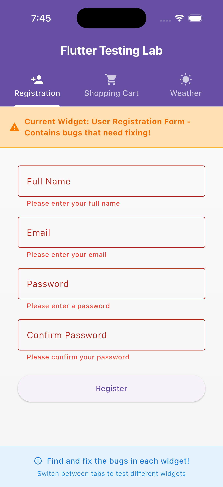
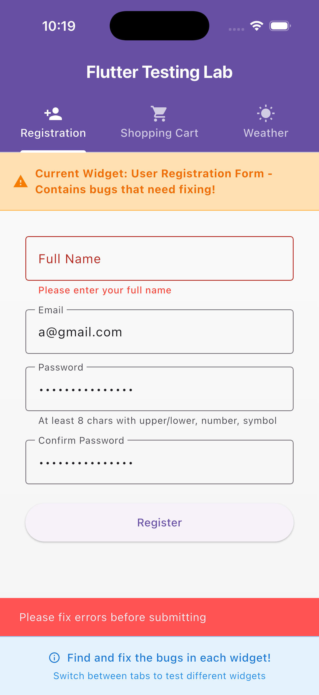
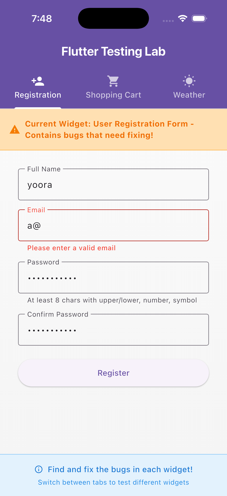
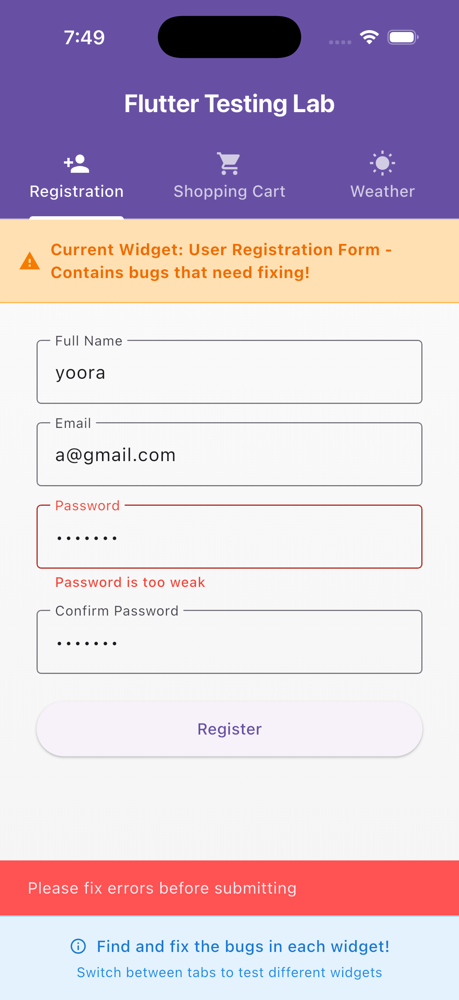
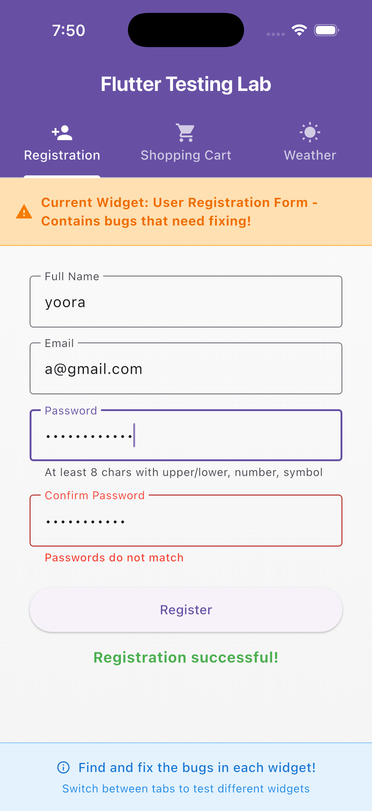
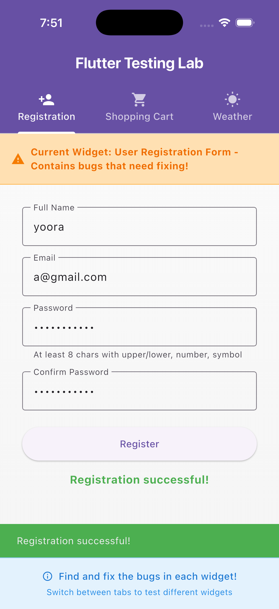

# User Registration Form Report

🐞 Bug Description

Issue Description
Email validation Accepted invalid formats such as a@ or @b
Password validation Allowed weak passwords without uppercase, digit, or symbol
Form validation Submitted even with empty or invalid fields
Missing tests No unit or widget tests to verify validation or submission

⸻

🔧 Solution Summary

 • Implemented regex-based email validation (^[\w-]+(\.[\w-]+)*@([\w-]+\.)+[a-zA-Z]{2,7}$)
 • Added strong password rules:
 • Minimum 8 characters
 • At least one uppercase, one lowercase, one digit, and one special character
 • Applied form validation before submission using _formKey.currentState?.validate()
 • Enabled real-time validation feedback with AutovalidateMode.onUserInteraction
 • Added SnackBar feedback for success/error messages
 • Removed old “bug warning” banner widgets after fixes
 • Created unit tests for validator functions and widget tests for full form flow
 • Covered edge cases (trimmed spaces, subdomain emails, short passwords, mismatched passwords)

⸻

🧪 Test Coverage Summary

Test Type Purpose Status
Unit Tests Validate email and password logic ✅ Passed
Widget Tests Verify UI feedback, validation errors, and success messages ✅ Passed
Edge Cases Subdomains (<user@mail.co>), trimmed inputs, missing symbol/digit ✅ Passed

✅ All tests executed successfully using:

flutter test

⸻

## 🧪 Tests Added

| Test Type | Coverage |
|------------|-----------|
| Unit Tests | Email and password validation logic |
| Widget Tests | Field validation messages, success flow |
| Edge Cases | Subdomain emails, spaces, weak passwords, mismatched passwords |

All tests passing ✅ using `flutter test`.

---

## 🖼️ Screenshots

| State | Screenshot |
|--------|-------------|
| 🟥 Empty Fields |  |
| 🟦 Full Name Error |  |
| 🟧 Invalid Email |  |
| 🟨 Weak Password |  |
| 🟪 Passwords Do Not Match |  |
| 🟩 Success |  |

⸻

🧠 Edge Cases Tested
 • Email with subdomains → ✅ <user@mail.example.co>
 • Email/password with spaces → ✅ auto-trimmed
 • Password length = 7 → ❌ rejected
 • Password missing symbol → ❌ rejected
 • Password missing digit → ❌ rejected
 • Password missing uppercase → ❌ rejected
 • All valid → ✅ registration success

⸻

🧩 Additional Notes
 • All validation now aligns with UX expectations and standard security rules.
 • Each invalid field displays an immediate inline message.
 • Success flow confirmed visually and through widget tests.
 • Form now fully prevents empty/invalid submissions.
 • Removed the placeholder “bug banners” from HomePage widget.
 • Updated Markdown report with final screenshots and test coverage.

⸻
