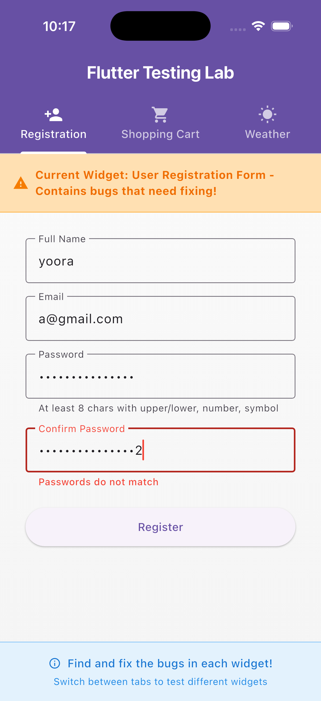

# Widget 1 — User Registration Form Report

## 🐞 Bug Description

| Issue | Description |
|--------|-------------|
| Email validation | Accepted invalid emails like `a@` or `@b` |
| Password validation | Weak passwords were accepted |
| Form validation | Form submitted even when fields were empty |
| Missing tests | No unit or widget tests for validation |

---

## 🔧 Solution Summary

- Added **regex-based email validation**  
- Implemented **strong password rules** (min 8 chars, upper/lower/digit/symbol)  
- Added **form validation before submission** using `_formKey.validate()`  
- Enabled **real-time validation feedback** via `AutovalidateMode.onUserInteraction`  
- Added **error messages for each invalid state**  
- Created **unit and widget tests** for coverage and reliability

---

## 🧪 Tests Added

| Test Type | Coverage |
|------------|-----------|
| Unit Tests | Email and password validation logic |
| Widget Tests | Field validation messages, success flow |
| Edge Cases | Subdomain emails, spaces, weak passwords, mismatched passwords |

All tests passing ✅ using `flutter test`.

---

## 🖼️ Screenshots

| State | Screenshot |
|--------|-------------|
| 🟥 Empty Fields |  |
| 🟧 Invalid Email |  |
| 🟨 Weak Password |  |
| 🟪 Passwords Do Not Match |  |
| 🟩 Success |  |

---

## 🧩 Notes

- All validation now matches UX expectations.  
- Each error message appears instantly under its field.  
- Success state verified visually and through automated tests.  
- Screenshots stored in `assets/screenshots/form/` for traceability.
