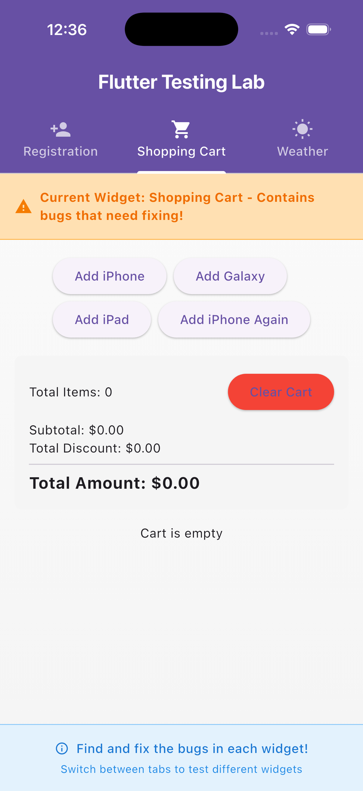

# 🛒 Widget 2 — Shopping Cart Report

## 🐞 Bug Description

| Issue | Description |
|--------|-------------|
| Duplicate items | Adding the same item twice created a new entry instead of increasing quantity |
| Discount logic | Discount calculation was incorrect (added instead of subtracted) |
| Total amount | Total included discount incorrectly, causing inflated totals |
| Edge cases | No handling for 100% discount, empty cart, or quantity limits |
| Tests | No unit or widget tests for cart logic |

---

## 🔧 Solution Summary

- ✅ **Duplicate Handling** — Fixed logic in `addItem()` to update quantity instead of adding duplicates  
- ✅ **Discount Fix** — Corrected formula to `price * quantity * discount`  
- ✅ **Total Calculation** — Now uses `(subtotal - totalDiscount).clamp(0, double.infinity)`  
- ✅ **Edge Case Protection**
  - Prevents quantity < 0
  - Clamps quantity between 1 and 99  
  - Prevents discount > subtotal  
  - Shows “FREE 🎉” when discount = 100%  
  - Displays “🛒 Cart is empty” message when cleared  
- ✅ **UI Enhancements**
  - Wrapped layout in `SingleChildScrollView`
  - Added flexible row to avoid overflow in small screens  
  - Improved discount visibility with color and symbols  
- ✅ **Testing**
  - Added widget tests for:
    - Adding items
    - Duplicate updates
    - Clearing cart
    - 100% discount display
    - Quantity edge cases

---

## 🖼️ Screenshots

| State | Screenshot |
|--------|-------------|
| ⌠Failing State (Before Fix) |  |
| ✅ Success State (After Fix) |  |

## 🧪 Test Coverage Summary

| Test | Description | Status |
|------|--------------|--------|
| Add Item | Adds product and updates subtotal | ✅ Passed |
| Add Duplicate | Increases quantity instead of duplicate entry | ✅ Passed |
| Clear Cart | Removes all items and shows empty message | ✅ Passed |
| 100% Discount | Displays “FREE 🎉” total for fully discounted items | ✅ Passed |
| Quantity Limits | Prevents quantity below 0 or above 99 | ✅ Passed |

✅ All tests executed successfully using:

```bash
flutter test
