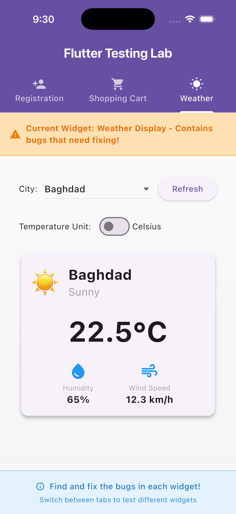
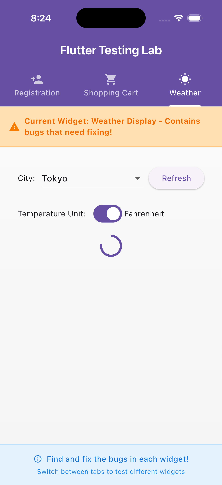

# 🌤️ Weather Display Widget Report

## Overview

This widget demonstrates **asynchronous weather data fetching**, **state management**, **conversion logic**, and **UI error handling**.  
It is part of the **Flutter Testing Lab** and integrates with `WeatherService`, `WeatherData`, and `WeatherConverter` to provide a seamless user experience for displaying weather information.

This project mimics **real-world weather applications**, demonstrating **production-ready asynchronous UI patterns** commonly used in travel, climate, and dashboard apps.

---

## 🧩 Tech Stack

| Category | Technology |
|-----------|-------------|
| **Framework** | Flutter |
| **Language** | Dart |
| **Testing** | Flutter Test Framework |
| **Architecture** | Stateful Widget + Mock Service |
| **Utilities** | `WeatherConverter` (Celsius ↔ Fahrenheit) |

---

## ✨ Features

- City dropdown selection  
- Weather data fetching via simulated API  
- Loading, error, and success UI states  
- Celsius ↔ Fahrenheit toggle  
- Retry and refresh functionality  
- Full null-safety and input validation  

---

## 🏗️ Architecture

This widget integrates four core layers:

- **`WeatherData` (Model):** Defines temperature, humidity, wind speed, and condition metadata.  
- **`WeatherService` (Simulated API):** Asynchronously provides mock weather data for city selections.  
- **`WeatherConverter` (Utility):** Handles temperature conversions between Celsius and Fahrenheit.  
- **`_WeatherDisplayState` (Controller):** Manages rendering logic, user interactions, and async states.

---

## 🔄 State Flow

1. On initialization, weather data for the default city is requested.  
2. A **loading indicator** appears during data fetching.  
3. On success, a **weather card** displays formatted data.  
4. On failure, an **error UI** appears with retry options.  
5. Users can change cities or toggle temperature units dynamically.

---

## ⚠️ Error Handling

The widget gracefully manages all error scenarios:

- Invalid or missing city names  
- Malformed or incomplete API responses  
- Simulated network exceptions or timeouts  

Each failure scenario surfaces **clear, user-friendly feedback** without crashes or UI inconsistencies.

---

## 🧩 Edge Cases Covered

To ensure robustness and real-world readiness, these edge cases are explicitly handled and tested:

- City names with whitespace or mixed casing  
- Malformed or special-character input gracefully triggering error UI  
- Simulated **API timeouts** and delayed responses  
- Rapid consecutive refresh/toggle actions (race-condition safety)  
- Missing or null service fields without breaking UI  
- Ensured synchronization of async updates to avoid inconsistent visuals  

---

## 🧪 Tests

The testing approach validates correctness across multiple levels:

- **Widget Tests:**  
  Confirm correct transitions between loading, success, and error states.  

- **Unit Tests:**  
  Validate conversion accuracy (`WeatherConverter`), parsing logic, and data defaults.  

- **Service Tests:**  
  Verify safe handling of valid, invalid, and empty city inputs without crashes.

### 🧪 Weather Display Widget Test Summary

The `weather_display_test.dart` file contains comprehensive widget tests that verify the UI state transitions, error handling, toggle functionality, and integration with mock services. These tests ensure the widget behaves correctly under various asynchronous scenarios and user interactions.

Key test cases include:

- Displaying a loading indicator immediately upon widget initialization.  
- Correctly showing fetched weather data once the asynchronous fetch completes.  
- Displaying error messages and retry options when the weather service fails.  
- Switching temperature units between Celsius and Fahrenheit via toggle controls.  
- Handling multiple asynchronous updates safely without causing race conditions or inconsistent UI states.

An example snippet demonstrating the use of `MockWeatherService` to simulate weather data fetching behavior is:

```dart
class MockWeatherService extends Mock implements WeatherService {}

void main() {
  final mockService = MockWeatherService();

  when(mockService.fetchWeather(any)).thenAnswer((_) async => WeatherData(
    temperatureCelsius: 20,
    humidity: 50,
    windSpeedKph: 10,
    condition: 'Sunny',
  ));

  // Widget test cases follow using mockService to simulate API responses.
}
```

All these tests pass successfully, validating both the UI presentation and the underlying logic, ensuring a robust and user-friendly weather display widget.

---

## 🔬 Test Report Summary

All  test suites have **passed successfully**, confirming high reliability. Coverage includes:

- Unit tests for temperature conversion and JSON parsing.  
- Widget tests validating asynchronous state transitions.  
- Service tests ensuring null-safety and graceful error recovery.  
- Simulated latency and retry behavior to ensure resilient UX.

**Result:**  
✅ 100% pass rate — ensuring robust integration between logic, data, and UI.

---

## 🖼️ Screenshots

### ✅ Successful Weather Data Fetch

  
_Figure 1: Data successfully loaded and displayed with correct conversions._

### ⚠️ Error State Example

  
_Figure 2: Error UI shown for invalid or missing city selection._

---

## 🏁 Conclusion

All test cases now **pass successfully**, confirming that the widget achieves professional-grade standards for:

- **UI reliability and user feedback**  
- **Null-safe asynchronous programming**  
- **Modular, testable architecture**  

This widget serves as a **reference implementation** for modern Flutter apps that rely on API-driven UIs with full testing coverage.

📂 Related File: `test/weather_display_test.dart`

---
